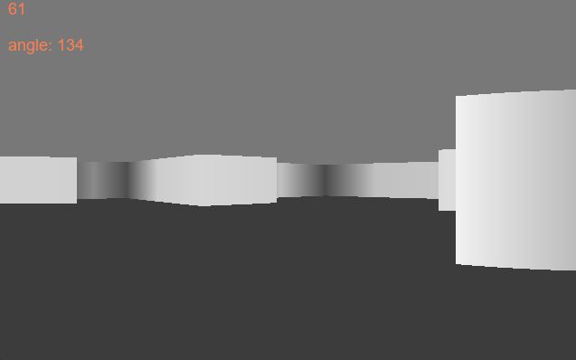

# Pygame-Raycasting
Pygamea hyödyntävä python ohjelma joka renderöi "3d" kartan jossa voi kävellä ympäriinsä. Peli hyödyntää uusinta uutta "Ray casting" teknologiaa jonka avulla muodostetaan kolmas ulottuvuus.
Peliin voi tehdä oman kartan kätevästi mukana tulevalla ```mapmaker.py``` ohjelmalla. (ps. nuolinäppäimillä käännetään kameraa ja wasd liikkuu)

## Oma kartta??
1. Aja ```mapmaker.py```
2. Karttaa klikkaamalla voi lisätä seiniä. (Jos teet väärin niin edellisen palikan voi poistaa painamalla z)
3. Paina pygame ikkunan ruksia. Tässä vaiheessa ohjelman pitäisi tulostaa pitkä lista koordinaatteja komentokehoitteeseen.
4. Kopioi tulostettu lista kokonaisuudessaan!
5. Avaa ```main.py``` ja poista sieltä muuttuja "walls".
6. Lisää muuttuja "walls" mutta liitätkin sen arvoksi äsken kopioimasi listan.

## Galleria


## Muuta
Jatkossa varmaan jos jaksan niin poistan pygamen ohjelmasta kokonaan ja koodaan itse myös grafiikan piirtämisen. 
No mutta taitaa vielä hetki mennä ennen kuin tästä tulee seuraava hitti pelimoottori
